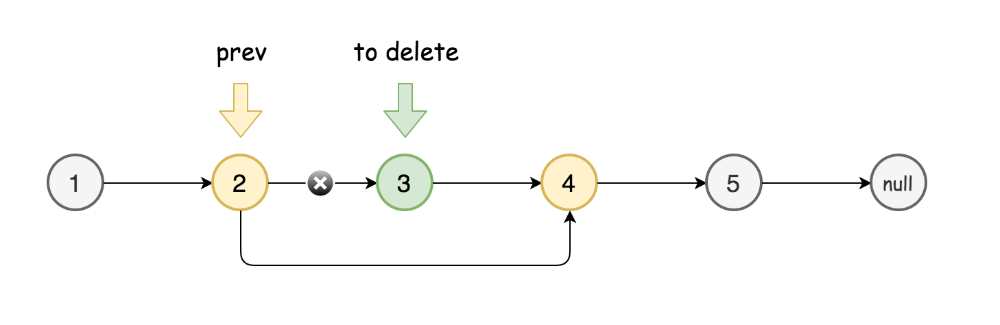
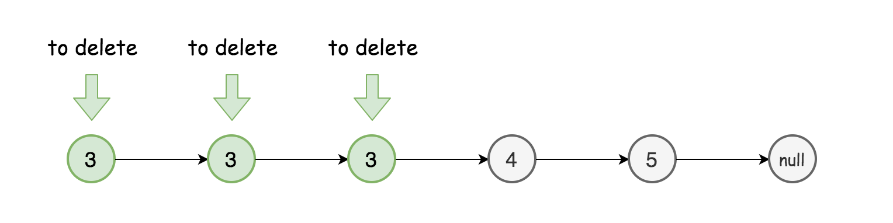

# 简单算法分析

---

## 1 移除链表元素

删除链表中等于给定值 ***val\*** 的所有节点。

示例:

- 输入: 1->2->6->3->4->5->6, val = 6
- 输出: 1->2->3->4->5


### 1.1 解法：哨兵节点

如果删除的节点是中间的节点，则问题似乎非常简单：

- 选择要删除节点的前一个结点 `prev`。
- 将 `prev` 的 `next` 设置为要删除结点的 `next`。




当要删除的一个或多个节点位于链表的头部时，事情会变得复杂。



可以通过哨兵节点去解决它，哨兵节点广泛应用于树和链表中，如伪头、伪尾、标记等，它们是纯功能的，通常不保存任何数据，其主要目的是使链表标准化，如使链表永不为空、永不无头、简化插入和删除。


在这里哨兵节点将被用于伪头。

算法：

1. 初始化哨兵节点为 ListNode(0) 且设置 sentinel.next = head。
2. 初始化两个指针 curr 和 prev 指向当前节点和前继节点。
3. 当 curr != nullptr：

   - 比较当前节点和要删除的节点：

     1. 若当前节点就是要删除的节点：则 prev.next = curr.next。
     2. 否则设 prve = curr。

   - 遍历下一个元素：curr = curr.next。
4. 返回 sentinel.next。

```c++
ListNode* removeElements(ListNode *head, int val) {
    ListNode* sentinel = new ListNode(0);
    sentinel->next = head;

    ListNode *prev = sentinel, *curr = head, *toDelete = nullptr;
    while (curr != nullptr) {
      if (curr->val == val) {
        prev->next = curr->next;
        toDelete = curr;
      } else prev = curr;

      curr = curr->next;

      if (toDelete != nullptr) {
        delete toDelete;
        toDelete = nullptr;
      }
    }

    ListNode *ret = sentinel->next;
    delete sentinel;
    return ret;
}
```

---


## 2 逆转单链表

反转一个单链表。

**示例:**

- 输入: 1->2->3->4->5->NULL
- 输出: 5->4->3->2->1->NULL


### 2.1 解法：链表拆分

1. 将一个链表拆分为两部分：
   1. L1：只包含头结点，且 $head->next = null$
   2. L2：包含剩下的全部节点，利用 $curr = head->next$，保存
2. 创建 $right， curr$ 两个指针，right 指向 curr 的下一位，每次遍历，将 curr 添加到 L1；curr，right 顺次下移
3. 当 $curr = null$ 时，遍历结束。

```c++
//反转单链表
ListNode* reverseList(ListNode* head) {
    //哨兵节点，类似头结点
    ListNode* sentinel = new ListNode(0);
    sentinel->next = head;

    ListNode *right, *curr;
    curr = sentinel->next;
    sentinel->next = nullptr;
    while (curr != nullptr){
        right = curr->next;
        curr->next = sentinel->next;
        sentinel->next = curr;
        curr = right;
    }
    head = sentinel->next;
    delete sentinel;
    return head;
}
```

---


## 3 用队列实现栈

请你仅使用两个队列实现一个后入先出（LIFO）的栈，并支持普通队列的全部四种操作（push、top、pop 和 empty）。

实现 MyStack 类：

- void push(int x) 将元素 x 压入栈顶。
- int pop() 移除并返回栈顶元素。
- int top() 返回栈顶元素。
- boolean empty() 如果栈是空的，返回 true ；否则，返回 false 。

注意：

1. 你只能使用队列的基本操作 —— 也就是 push to back、peek/pop from front、size 和 is empty 这些操作。
2. 你所使用的语言也许不支持队列。 你可以使用 list （列表）或者 deque（双端队列）来模拟一个队列，只要是标准的队列操作即可。

示例：

- 输入：
  ["MyStack", "push", "push", "top", "pop", "empty"]
  [[], [1], [2], [], [], []]
- 输出：
  [null, null, null, 2, 2, false]
- 解释：
  MyStack myStack = new MyStack();
  myStack.push(1);
  myStack.push(2);
  myStack.top(); // 返回 2
  myStack.pop(); // 返回 2
  myStack.empty(); // 返回 False


### 3.1 解法一：两个队列

为了满足栈的特性，即最后入栈的元素最先出栈，在使用队列实现栈时，应满足队列前端的元素是最后入栈的元素。

可以使用两个队列实现栈的操作，其中 $\textit{queue}_1$ 用于存储栈内的元素，$\textit{queue}_2$ 作为入栈操作的辅助队列。

入栈操作时，首先将元素入队到 $\textit{queue}_2$ ，然后将 $\textit{queue}_1$ 的全部元素依次出队并入队到 $\textit{queue}_2$ ，此时 $\textit{queue}_2$ 的前端的元素即为新入栈的元素，再将 $\textit{queue}_1$ 和 $\textit{queue}_2$ 互换，则 $\textit{queue}_1$ 的元素即为栈内的元素，$\textit{queue}_1$ 的前端和后端分别对应栈顶和栈底。

由于每次入栈操作都确保 $\textit{queue}_1$ 的前端元素为栈顶元素，因此出栈操作和获得栈顶元素操作都可以简单实现。出栈操作只需要移除 $\textit{queue}_1$ 的前端元素并返回即可，获得栈顶元素操作只需要获得 $\textit{queue}_1$ 的前端元素并返回即可（不移除元素）。

由于 $\textit{queue}_1$ 用于存储栈内的元素，判断栈是否为空时，只需要判断 $\textit{queue}_1$ 是否为空即可。


```c++
class MyStack {
public:
    queue<int> queue1;
    queue<int> queue2;

    /** Initialize your data structure here. */
    MyStack() {

    }

    /** Push element x onto stack. */
    void push(int x) {
        queue2.push(x);
        while (!queue1.empty()) {
            queue2.push(queue1.front());
            queue1.pop();
        }
        swap(queue1, queue2);
    }
    
    /** Removes the element on top of the stack and returns that element. */
    int pop() {
        int r = queue1.front();
        queue1.pop();
        return r;
    }
    
    /** Get the top element. */
    int top() {
        int r = queue1.front();
        return r;
    }
    
    /** Returns whether the stack is empty. */
    bool empty() {
        return queue1.empty();
    }
};
```


### 3.2 解法二：一个队列

方法一使用了两个队列实现栈的操作，也可以使用一个队列实现栈的操作。

使用一个队列时，为了满足栈的特性，即最后入栈的元素最先出栈，同样需要满足队列前端的元素是最后入栈的元素。

入栈操作时，首先获得入栈前的元素个数 n，然后将元素入队到队列，再将队列中的前 n 个元素（即除了新入栈的元素之外的全部元素）依次出队并入队到队列，此时队列的前端的元素即为新入栈的元素，且队列的前端和后端分别对应栈顶和栈底。

由于每次入栈操作都确保队列的前端元素为栈顶元素，因此出栈操作和获得栈顶元素操作都可以简单实现。出栈操作只需要移除队列的前端元素并返回即可，获得栈顶元素操作只需要获得队列的前端元素并返回即可（不移除元素）。

由于队列用于存储栈内的元素，判断栈是否为空时，只需要判断队列是否为空即可。


```c++
class MyStack {
public:
    queue<int> q;

    /** Initialize your data structure here. */
    MyStack() {

    }

    /** Push element x onto stack. */
    void push(int x) {
        int n = q.size();
        q.push(x);
        for (int i = 0; i < n; i++) {
            q.push(q.front());
            q.pop();
        }
    }
    
    /** Removes the element on top of the stack and returns that element. */
    int pop() {
        int r = q.front();
        q.pop();
        return r;
    }
    
    /** Get the top element. */
    int top() {
        int r = q.front();
        return r;
    }
    
    /** Returns whether the stack is empty. */
    bool empty() {
        return q.empty();
    }
};
```

---


## 4 反转二叉树

翻转一棵二叉树。

示例：

- 输入：

  ```text
       4
     /   \
    2     7
   / \   / \
  1   3 6   9
  ```

- 输出：

  ```text
       4
     /   \
    7     2
   / \   / \
  9   6 3   1
  ```


### 4.1 解法一：从根节点开始反转

从根节点开始反转，从上往下进行递归

```c++
//反转二叉树，从根节点开始反转，顺次递归
TreeNode* invertTree_1(TreeNode* root) {
    if (root == nullptr){
        return root;
    }
  
    //反转左右子树  
    TreeNode* curr = new TreeNode();
    curr = root->left;
    root->left = root->right;
    root->right = curr;
  
    //顺次递归
    invertTree_1(root->left);
    invertTree_1(root->right);
    return root;
}
```


### 4.2 解法二：从叶子节点开始反转

从根节点开始，递归地对树进行遍历，并从叶子结点先开始翻转。如果当前遍历到的节点 \textit{root}root 的左右两棵子树都已经翻转，那么我们只需要交换两棵子树的位置，即可完成以 \textit{root}root 为根节点的整棵子树的翻转。

```c++
//反转二叉树，从叶子节点开始反转，从下往上递归
TreeNode* invertTree(TreeNode* root) {
    if (root == nullptr) {
        return nullptr;
    }

    TreeNode* left = invertTree(root->left);
    TreeNode* right = invertTree(root->right);
    root->left = right;
    root->right = left;
    return root;
}
```

---


## 5 用栈实现队列

请你仅使用两个栈实现先入先出队列。队列应当支持一般队列的支持的所有操作（push、pop、peek、empty）：

实现 MyQueue 类：

1. void push(int x) 将元素 x 推到队列的末尾
2. int pop() 从队列的开头移除并返回元素
3. int peek() 返回队列开头的元素
4. boolean empty() 如果队列为空，返回 true ；否则，返回 false


说明：

1. 你只能使用标准的栈操作 —— 也就是只有 push to top, peek/pop from top, size, 和 is empty 操作是合法的。
2. 你所使用的语言也许不支持栈。你可以使用 list 或者 deque（双端队列）来模拟一个栈，只要是标准的栈操作即可。


### 5.1 解法一

1. **入队（push）：**

   一个队列是 FIFO 的，但一个栈是 LIFO 的。这就意味着最新压入的元素必须得放在栈底。为了实现这个目的，我们首先需要把 `s1` 中所有的元素移到 `s2` 中，接着把新元素压入 `s2`。最后把 `s2` 中所有的元素弹出，再把弹出的元素压入 `s1`。


2. **出队（pop）：**

   直接从 `s1` 弹出就可以了，因为 `s1` 的栈顶元素就是队列的队首元素。


3. **判断空（empty）：**

   `s1` 存储了队列所有的元素，所以只需要检查 `s1` 的是否为空就可以了。

4. **取队首元素（peek）：**

   直接返回 order 的栈顶元素。

```c++
class MyQueue {
public:
    // Initialize your data structure here.
    MyQueue() {}
    // Push element x to the back of queue. 
    void push(int x) {
        while (!order.empty()){   //将顺序栈元素出栈并压入逆序栈中
            reverse.push(order.top());
            order.pop();
        }
        reverse.push(x); 
        while (!reverse.empty()) {  //把逆序栈元素出栈并压入顺序栈中，使得top=front
            order.push(reverse.top());
            reverse.pop();
        }
    }
    // Removes the element from in front of queue and returns that element.
    int pop() {
        int data = order.top();
        order.pop();
        return data;
    }
    // Get the front element.
    int peek() {
        return order.top();
    }
    // Returns whether the queue is empty.
    bool empty() {
        return order.empty();
    }
private:
    stack<int> order;   //top为queue的front
    stack<int> reverse; //与order逆序
};

/**
 * Your MyQueue object will be instantiated and called as such:
 * MyQueue* obj = new MyQueue();
 * obj->push(x);
 * int param_2 = obj->pop();
 * int param_3 = obj->peek();
 * bool param_4 = obj->empty();
 */
```

---


## 6 回文链表

请判断一个链表是否为回文链表。

**示例 1:**

```
输入: 1->2
输出: false
```

**示例 2:**

```
输入: 1->2->2->1
输出: true
```


### 6.1 解法一：借助数组

一共为两个步骤：

1. 复制链表值到数组列表中。
2. 使用双指针法判断是否为回文。

第一步，我们需要遍历链表将值复制到数组列表中。我们用 currentNode 指向当前节点。每次迭代向数组添加 currentNode.val，并更新 currentNode = currentNode.next，当 currentNode = null 时停止循环。

执行第二步的最佳方法取决于你使用的语言。在 Python 中，很容易构造一个列表的反向副本，也很容易比较两个列表。而在其他语言中，就没有那么简单。因此最好使用双指针法来检查是否为回文。我们在起点放置一个指针，在结尾放置一个指针，每一次迭代判断两个指针指向的元素是否相同，若不同，返回 false；相同则将两个指针向内移动，并继续判断，直到两个指针相遇。

在编码的过程中，注意我们比较的是节点值的大小，而不是节点本身。

正确的比较方式是：

- `node_1.val == node_2.val`，而 `node_1 == node_2` 是错误的。

```c++
/**
 * 判断链表是否回文
 * 解法：借助数组
 * 
 */
bool isPalindrome(ListNode* head) {
    ListNode *curr = head;
    vector<int> nums;
    while(curr != nullptr){
        nums.push_back(curr->val);
        curr = curr->next;
    }
    for (int i = 0, j = (int)nums.size()-1; i < j; ++i, --j){
        if(nums[i] != nums[j]){
            return false;
        }
    }
    return true;
    
}
```


### 6.2 解法二：快慢指针

避免使用 O(n)O(n) 额外空间的方法就是改变输入。

我们可以将链表的后半部分反转（修改链表结构），然后将前半部分和后半部分进行比较。比较完成后我们应该将链表恢复原样。虽然不需要恢复也能通过测试用例，但是使用该函数的人通常不希望链表结构被更改。

该方法虽然可以将空间复杂度降到 O(1)，但是在并发环境下，该方法也有缺点。在并发环境下，函数运行时需要锁定其他线程或进程对链表的访问，因为在函数执行过程中链表会被修改。

算法：

整个流程可以分为以下五个步骤：

1. 找到前半部分链表的尾节点。
2. 反转后半部分链表。
3. 判断是否回文。
4. 恢复链表。
5. 返回结果。

执行步骤一，我们可以计算链表节点的数量，然后遍历链表找到前半部分的尾节点。

我们也可以使用快慢指针在一次遍历中找到：慢指针一次走一步，快指针一次走两步，快慢指针同时出发。当快指针移动到链表的末尾时，慢指针恰好到链表的中间。通过慢指针将链表分为两部分。

若链表有奇数个节点，则中间的节点应该看作是前半部分。

步骤二可以使用「206. 反转链表」问题中的解决方法来反转链表的后半部分。

步骤三比较两个部分的值，当后半部分到达末尾则比较完成，可以忽略计数情况中的中间节点。

步骤四与步骤二使用的函数相同，再反转一次恢复链表本身。

```c++
bool isPalindrome(ListNode* head) {
    if (head == nullptr) {
        return true;
    }

    // 找到前半部分链表的尾节点并反转后半部分链表
    ListNode* firstHalfEnd = endOfFirstHalf(head);
    ListNode* secondHalfStart = reverseList(firstHalfEnd->next);

    // 判断是否回文
    ListNode* p1 = head;
    ListNode* p2 = secondHalfStart;
    bool result = true;
    while (result && p2 != nullptr) {
        if (p1->val != p2->val) {
            result = false;
        }
        p1 = p1->next;
        p2 = p2->next;
    }        

    // 还原链表并返回结果
    firstHalfEnd->next = reverseList(secondHalfStart);
    return result;
}

ListNode* reverseList(ListNode* head) {
    ListNode* prev = nullptr;
    ListNode* curr = head;
    while (curr != nullptr) {
        ListNode* nextTemp = curr->next;
        curr->next = prev;
        prev = curr;
        curr = nextTemp;
    }
    return prev;
}

ListNode* endOfFirstHalf(ListNode* head) {
    ListNode* fast = head;
    ListNode* slow = head;
    while (fast->next != nullptr && fast->next->next != nullptr) {
        fast = fast->next->next;
        slow = slow->next;
    }
    return slow;
}
```

---


## 7 二叉搜索树的最近公共祖先

给定一个二叉搜索树, 找到该树中两个指定节点的最近公共祖先。

百度百科中最近公共祖先的定义为：“对于有根树 T 的两个结点 p、q，最近公共祖先表示为一个结点 x，满足 x 是 p、q 的祖先且 x 的深度尽可能大（一个节点也可以是它自己的祖先）。”

例如，给定如下二叉搜索树:  root = [6,2,8,0,4,7,9,null,null,3,5]


1. 示例 1:

   输入: root = [6,2,8,0,4,7,9,null,null,3,5], p = 2, q = 8
   输出: 6 
   解释: 节点 2 和节点 8 的最近公共祖先是 6。

2. 示例 2:

   输入: root = [6,2,8,0,4,7,9,null,null,3,5], p = 2, q = 4
   输出: 2
   解释: 节点 2 和节点 4 的最近公共祖先是 2, 因为根据定义最近公共祖先节点可以为节点本身。

说明:

1. 所有节点的值都是唯一的。
2. p、q 为不同节点且均存在于给定的二叉搜索树中。


### 7.1 解法一：两次遍历

注意到题目中给出的是一棵「二叉搜索树」，因此我们可以快速地找出树中的某个节点以及从根节点到该节点的路径，例如我们需要找到节点 p：

1. 我们从根节点开始遍历；
2. 如果当前节点就是 p，那么成功地找到了节点；
3. 如果当前节点的值大于 p 的值，说明 p 应该在当前节点的左子树，因此将当前节点移动到它的左子节点；
4. 如果当前节点的值小于 p 的值，说明 p 应该在当前节点的右子树，因此将当前节点移动到它的右子节点。

对于节点 q 同理。在寻找节点的过程中，我们可以顺便记录经过的节点，这样就得到了从根节点到被寻找节点的路径。

当我们分别得到了从根节点到 p 和 q 的路径之后，我们就可以很方便地找到它们的最近公共祖先了。显然，p 和 q 的最近公共祖先就是从根节点到它们路径上的「分岔点」，也就是最后一个相同的节点。因此，如果我们设从根节点到 p 的路径为数组 path_p​，从根节点到 path_q，那么只要找出最大的编号 i，其满足path_p[i]=path_q[i]，那么对应的节点就是「分岔点」，即 p 和 q 的最近公共祖先。

```c++
/**
 * 二叉搜索树的最近公共祖先
 * 解法一：两次遍历
 */ 
TreeNode* lowestCommonAncestor(TreeNode* root, TreeNode* p, TreeNode* q) {
    vector<TreeNode*> path_p, path_q;
    TreeNode* curr;
    path_p = getPath(root, p);
    path_q = getPath(root, q);
    for(int i = 0; i < path_p.size() && i < path_q.size(); ++i){
        if(path_p[i]->val == path_q[i]->val){
            curr = path_p[i-1];
        }
        else{
            break;
        }
    }
    return curr;
}

vector<TreeNode*> getPath(TreeNode* root, TreeNode* target){
    vector<TreeNode*> path;
    TreeNode* curr = root;
    while(curr->val != target->val){
        path.push_back(curr);
        if(curr->val < target->val){
            curr = curr->right;
        }
        else{
            curr = curr->left;
        }
    }
    path.push_back(curr);
    return path;
}
```

---


### 7.2 解法二：一次遍历

在方法一中，我们对从根节点开始，通过遍历找出到达节点 p 和 q 的路径，一共需要两次遍历。我们也可以考虑将这两个节点放在一起遍历。

整体的遍历过程与方法一中的类似：

1. 我们从根节点开始遍历；
2. 如果当前节点的值大于 p 和 q 的值，说明 p 和 q 应该在当前节点的左子树，因此将当前节点移动到它的左子节点；
3. 如果当前节点的值小于 p 和 q 的值，说明 p 和 q 应该在当前节点的右子树，因此将当前节点移动到它的右子节点；
4. 如果当前节点的值不满足上述两条要求，那么说明当前节点就是「分岔点」。此时，p 和 q 要么在当前节点的不同的子树中，要么其中一个就是当前节点。

```c++
/**
 * 二叉搜索树的最近公共祖先
 * 解法二：一次遍历 
 */
TreeNode* lowestCommonAncestor_2(TreeNode* root, TreeNode* p, TreeNode* q) {
    TreeNode* ancestor = root;
    while (true) {
        if (p->val < ancestor->val && q->val < ancestor->val) {
            ancestor = ancestor->left;
        }
        else if (p->val > ancestor->val && q->val > ancestor->val) {
            ancestor = ancestor->right;
        }
        else {
            break;
        }
    }
    return ancestor;
}
```

---


## 8 删除链表中的节点

请编写一个函数，使其可以删除某个链表中给定的（非末尾）节点。传入函数的唯一参数为 **要被删除的节点**。

 现有一个链表 -- head = [4,5,1,9]，它可以表示为：


1. 示例 1：

   输入：head = [4,5,1,9], node = 5
   输出：[4,1,9]
   解释：给定你链表中值为 5 的第二个节点，那么在调用了你的函数之后，该链表应变为 4 -> 1 -> 9.

2. 示例 2：

   输入：head = [4,5,1,9], node = 1
   输出：[4,5,9]
   解释：给定你链表中值为 1 的第三个节点，那么在调用了你的函数之后，该链表应变为 4 -> 5 -> 9.

提示：

1. 链表至少包含两个节点。
2. 链表中所有节点的值都是唯一的。
3. 给定的节点为非末尾节点并且一定是链表中的一个有效节点。
4. 不要从你的函数中返回任何结果。


### 8.1 解法：复制下一个节点，删除下一个节点

```c++
/**
 * 删除指定节点
 * 解法：复制下一个节点，并删除下一个节点
 */ 
void deleteNode(ListNode* node) {
    node->val = node->next->val;
    node->next = node->next->next;
}
```

---


## 9 二叉树的全部路径

给定一个二叉树，返回所有从根节点到叶子节点的路径。

说明: 叶子节点是指没有子节点的节点。

示例:

输入:

```
   1
 /   \
2     3
 \
  5
```

输出: ["1->2->5", "1->3"]

解释: 所有根节点到叶子节点的路径为: 1->2->5, 1->3


### 9.1 解法一：深度搜索优先

最直观的方法是使用深度优先搜索。在深度优先搜索遍历二叉树时，我们需要考虑当前的节点以及它的孩子节点。

1. 如果当前节点不是叶子节点，则在当前的路径末尾添加该节点，并继续递归遍历该节点的每一个孩子节点。
2. 如果当前节点是叶子节点，则在当前路径末尾添加该节点后我们就得到了一条从根节点到叶子节点的路径，将该路径加入到答案即可。

如此，当遍历完整棵二叉树以后我们就得到了所有从根节点到叶子节点的路径。

```c++
// 获取路径
void getTreePath(vector<string>& paths, string path, TreeNode* root){
    if(root != nullptr){
        path += to_string(root->val);
        if(root->left == nullptr && root->right == nullptr){
            paths.push_back(path);
        }
        else{
            path += "->";
            getTreePath(paths, path, root->left);
            getTreePath(paths, path, root->right);
        }
    }
}

/**
 * 二叉树中的所有路径
 * 解法一：深度优先搜索
 */ 
vector<string> binaryTreePaths(TreeNode* root) {
    vector<string> paths;
    string path = "";
    TreeNode* node = root;
    getTreePath(paths, path, node);
    return paths;
}
```

---


### 9.2 解法二：广度搜索优先

我们也可以用广度优先搜索来实现。我们维护一个队列，存储节点以及根到该节点的路径。一开始这个队列里只有根节点。在每一步迭代中，我们取出队列中的首节点，如果它是叶子节点，则将它对应的路径加入到答案中。如果它不是叶子节点，则将它的所有孩子节点加入到队列的末尾。当队列为空时广度优先搜索结束，我们即能得到答案。

```c++
/**
 * 二叉树中的所有路径
 * 解法二：广度搜索优先
 * 利用 c++ 提供的队列：queue
 */
vector<string> binaryTreePaths_2(TreeNode* root) {
    vector<string> paths;
    if (root == nullptr) {
        return paths;
    }
    //c++ 提供 queue类
    queue<TreeNode*> node_queue;
    queue<string> path_queue;

    node_queue.push(root);
    path_queue.push(to_string(root->val));

    while (!node_queue.empty()) {
        TreeNode* node = node_queue.front();
        string path = path_queue.front();
        node_queue.pop();
        path_queue.pop();

        if (node->left == nullptr && node->right == nullptr) {
            paths.push_back(path);
        } else {
            if (node->left != nullptr) {
                node_queue.push(node->left);
                path_queue.push(path + "->" + to_string(node->left->val));
            }

            if (node->right != nullptr) {
                node_queue.push(node->right);
                path_queue.push(path + "->" + to_string(node->right->val));
            }
        }
    }
    return paths;
}

```

---


## 10 左叶子之和

计算给定二叉树的所有左叶子之和。

示例：

        3
       / \
      9  20
        /  \
       15   7
在这个二叉树中，有两个左叶子，分别是 9 和 15，所以返回 24


### 思路

一个节点为「左叶子」节点，当且仅当它是某个节点的左子节点，并且它是一个叶子结点。因此我们可以考虑对整棵树进行遍历，当我们遍历到节点 node 时，如果它的左子节点是一个叶子结点，那么就将它的左子节点的值累加计入答案。

### 解法一：深度优先搜索

```c++
/**
 * 判断是否为叶子节点
 * @param node
 * @return
 */
bool isLeafNode(TreeNode* node){
    return !node->left && !node->right;
}

/**
 * 深度优先搜索二叉树，返回各左叶子节点值
 * @param root
 * @return
 */
int dfs(TreeNode* node){
    int ans = 0;
    if (node->left){
        ans += isLeafNode(node->left)? node->left->val: dfs(node->left);
    }
    if (node->right && !isLeafNode(node->right)){
        ans += dfs(node->right);
    }
    // return ans，添加返回值，使得递归能正常实现累加操作
    return ans;
}
/**
 * 左叶子之和，深度优先搜索
 * @param root
 * @return
 */
int sumOfLeftLeaves(TreeNode* root) {
    return root? dfs(root):0;
}
```

---


### 解法二：广度优先搜索

```c++
/**
 * 判断是否为叶子节点
 * @param node
 * @return
 */
bool isLeafNode(TreeNode* node){
    return !node->left && !node->right;
}

/**
 * 左叶子之和，广度优先搜索
 */
int sumOfLeftLeaves_2(TreeNode* root){
    if (!root){
        return 0;
    }
    // 利用队列存储二叉树中的节点
    queue<TreeNode*> TreeNode_Queue;
    TreeNode_Queue.push(root);
    int ans = 0;
    while (!TreeNode_Queue.empty()){
        // 取出队头
        TreeNode* node = TreeNode_Queue.front();
        TreeNode_Queue.pop();
        if (node->left){
            if (isLeafNode(node->left)){
                ans += node->left->val;
            }
            else{
                // 将 非叶子节点 压入队列
                TreeNode_Queue.push(node->left);
            }
        }
        if (node->right){
            if (!isLeafNode(node->right)){
                // 将 非叶子节点 压入队列
                TreeNode_Queue.push(node->right);
            }
        }
    }
    return ans;
}
```


# 数据结构

---

## 1 单链表

```c++
struct ListNode {
    int val;
    ListNode *next;
    ListNode() : val(0), next(nullptr) {}
    ListNode(int x) : val(x), next(nullptr) {}
    ListNode(int x, ListNode *next) : val(x), next(next) {}
 };

//尾插法创建不带表头节点单链表，先进先出
int initNodeList_01(ListNode *&L, int a[], int length){
    ListNode *s, *r;
    L = (ListNode *)malloc(sizeof(ListNode));
    L->next = NULL;
    r = L;
    for (int i = 0; i < length; i++){
        s = (ListNode *)malloc(sizeof(ListNode));
        s->val = a[i];
        r->next = s; s->next = NULL;
        r = s;
    }
    //头结点后移一位，使得不带头结点
    L = L->next;
    return OK;
}

//顺序打印链表
void printNodeList(ListNode *L){
    ListNode *p;
    p = L;
    while (p){
        printf("%d  ", p->val);
        p = p->next;
    }
    printf("\n");
}
```

---


## 2 二叉树

```c++
//定义二叉树
struct TreeNode {
    int val;
    TreeNode *left;
    TreeNode *right;
    TreeNode() : val(0), left(nullptr), right(nullptr) {}
    TreeNode(int x) : val(x), left(nullptr), right(nullptr) {}
    TreeNode(int x, TreeNode *left, TreeNode *right) : val(x), left(left), right(right) {}
 };
```

---

#### 2.1 二叉搜索树

给出的是一棵「二叉搜索树」，因此我们可以快速地找出树中的某个节点以及从根节点到该节点的路径，例如我们需要找到节点 p：

1. 我们从根节点开始遍历；
2. 如果当前节点就是 p，那么成功地找到了节点；
3. 如果当前节点的值大于 p 的值，说明 p 应该在当前节点的左子树，因此将当前节点移动到它的左子节点；
4. 如果当前节点的值小于 p 的值，说明 p 应该在当前节点的右子树，因此将当前节点移动到它的右子节点。


# C++ 基础知识

## 1 vector

### 1.1 什么是vector？

向量（Vector）是一个封装了动态大小数组的顺序容器（Sequence Container）。跟任意其它类型容器一样，它能够存放各种类型的对象。可以简单的认为，向量是一个能够存放任意类型的动态数组。

------

### 1.2 容器特性

#### 1.2.1 顺序序列

顺序容器中的元素按照严格的线性顺序排序。可以通过元素在序列中的位置访问对应的元素。

#### 1.2.2 动态数组

支持对序列中的任意元素进行快速直接访问，甚至可以通过指针算述进行该操作。操供了在序列末尾相对快速地添加/删除元素的操作。

#### 1.2.3 能够感知内存分配器的（Allocator-aware）

容器使用一个内存分配器对象来动态地处理它的存储需求。

------

### 1.3 基本函数实现

#### 1.构造函数

- vector():创建一个空vector
- vector(int nSize):创建一个vector,元素个数为nSize
- vector(int nSize,const t& t):创建一个vector，元素个数为nSize,且值均为t
- vector(const vector&):复制构造函数
- vector(begin,end):复制[begin,end)区间内另一个数组的元素到vector中

#### 2.增加函数

- void push_back(const T& x):向量尾部增加一个元素X
- iterator insert(iterator it,const T& x):向量中迭代器指向元素前增加一个元素x
- iterator insert(iterator it,int n,const T& x):向量中迭代器指向元素前增加n个相同的元素x
- iterator insert(iterator it,const_iterator first,const_iterator last):向量中迭代器指向元素前插入另一个相同类型向量的[first,last)间的数据

#### 3.删除函数

- iterator erase(iterator it):删除向量中迭代器指向元素
- iterator erase(iterator first,iterator last):删除向量中[first,last)中元素
- void pop_back():删除向量中最后一个元素
- void clear():清空向量中所有元素

#### 4.遍历函数

- reference at(int pos):返回pos位置元素的引用
- reference front():返回首元素的引用
- reference back():返回尾元素的引用
- iterator begin():返回向量头指针，指向第一个元素
- iterator end():返回向量尾指针，指向向量最后一个元素的下一个位置
- reverse_iterator rbegin():反向迭代器，指向最后一个元素
- reverse_iterator rend():反向迭代器，指向第一个元素之前的位置

#### 5.判断函数

- bool empty() const:判断向量是否为空，若为空，则向量中无元素

#### 6.大小函数

- int size() const:返回向量中元素的个数
- int capacity() const:返回当前向量所能容纳的最大元素值
- int max_size() const:返回最大可允许的vector元素数量值

#### 7.其他函数

- void swap(vector&):交换两个同类型向量的数据
- void assign(int n,const T& x):设置向量中前n个元素的值为x
- void assign(const_iterator first,const_iterator last):向量中[first,last)中元素设置成当前向量元素

#### 8.基本函数一览

> 1.push_back 在数组的最后添加一个数据
>
> 2.pop_back 去掉数组的最后一个数据
>
> 3.at 得到编号位置的数据
>
> 4.begin 得到数组头的指针
>
> 5.end 得到数组的最后一个单元+1的指针
>
> 6．front 得到数组头的引用
>
> 7.back 得到数组的最后一个单元的引用
>
> 8.max_size 得到vector最大可以是多大
>
> 9.capacity 当前vector分配的大小
>
> 10.size 当前使用数据的大小
>
> 11.resize 改变当前使用数据的大小，如果它比当前使用的大，者填充默认值
>
> 12.reserve 改变当前vecotr所分配空间的大小
>
> 13.erase 删除指针指向的数据项
>
> 14.clear 清空当前的vector
>
> 15.rbegin 将vector反转后的开始指针返回(其实就是原来的end-1)
>
> 16.rend 将vector反转构的结束指针返回(其实就是原来的begin-1)
>
> 17.empty 判断vector是否为空
>
> 18.swap 与另一个vector交换数据

------

### 1.4 基本用法

```c++
#include <vector> 
using namespace std;
```

------

### 1.5 简单介绍

1. Vector<类型>标识符
2. Vector<类型>标识符(最大容量)
3. Vector<类型>标识符(最大容量,初始所有值)
4. Int i[5]={1,2,3,4,5}
   Vector<类型>vi(I,i+2);//得到i索引值为3以后的值
5. Vector< vector< int> >v; 二维向量//这里最外的<>要有空格。否则在比较旧的编译器下无法通过

------

### 1.6 实例

#### 1 插入 / 弹出

pop_back() & push_back(elem)。实例在容器最后移除和插入数据

```c++
#include <string.h>
#include <vector>
#include <iostream>
using namespace std;
 
int main()
{
    vector<int>obj;//创建一个向量存储容器 int
    for(int i=0;i<10;i++) // push_back(elem)在数组最后添加数据 
    {
        obj.push_back(i);
        cout<<obj[i]<<",";    
    }
 
    for(int i=0;i<5;i++)//去掉数组最后一个数据 
    {
        obj.pop_back();
    }
 
    cout<<"\n"<<endl;
 
    for(int i=0;i<obj.size();i++)//size()容器中实际数据个数 
    {
        cout<<obj[i]<<",";
    }
 
    return 0;
}

// 输出结果：
0,1,2,3,4,5,6,7,8,9,
0,1,2,3,4,
```


#### 2 clear()

清除容器中所有数据

```c++
#include <string.h>
#include <vector>
#include <iostream>
using namespace std;
 
int main()
{
    vector<int>obj;
    for(int i=0;i<10;i++)//push_back(elem)在数组最后添加数据 
    {
        obj.push_back(i);
        cout<<obj[i]<<",";
    }
 
    obj.clear();//清除容器中所以数据
    for(int i=0;i<obj.size();i++)
    {
        cout<<obj[i]<<endl;
    }
 
    return 0;
}

//输出结果
0,1,2,3,4,5,6,7,8,9,
```


#### 3 排序

```c++
#include <string.h>
#include <vector>
#include <iostream>
#include <algorithm> // 引用 sort
using namespace std;
 
int main()
{
    vector<int>obj;
 
    obj.push_back(1);
    obj.push_back(3);
    obj.push_back(0);
 
    sort(obj.begin(),obj.end());//从小到大
 
    cout<<"从小到大:"<<endl;
    for(int i=0;i<obj.size();i++)
    {
        cout<<obj[i]<<",";  
    } 
 
    cout<<"\n"<<endl;
 
    cout<<"从大到小:"<<endl;
    reverse(obj.begin(),obj.end());//从大到小 
    for(int i=0;i<obj.size();i++)
    {
        cout<<obj[i]<<",";
    }
    return 0;
}

// 输出结果：
从小到大:
0,1,3,

从大到小:
3,1,0,
```

```c++
// 利用 sort 进行降序
bool compare(int a,int b) 
{ 
    return a< b; //升序排列，如果改为return a>b，则为降序 
} 
int a[20]={2,4,1,23,5,76,0,43,24,65},i; 
for(i=0;i<20;i++) 
    cout<< a[i]<< endl; 
sort(a,a+20,compare);
```


#### 4.访问

（直接数组访问&迭代器访问）

```c++
#include <string.h>
#include <vector>
#include <iostream>
#include <algorithm>
using namespace std;
 
int main()
{
    //顺序访问
    vector<int>obj;
    for(int i=0;i<10;i++)
    {
        obj.push_back(i);   
    } 
 
    cout<<"直接利用数组："; 
    for(int i=0;i<10;i++)//方法一 
    {
        cout<<obj[i]<<" ";
    }
 
    cout<<endl; 
    cout<<"利用迭代器：" ;
    //方法二，使用迭代器将容器中数据输出 
    vector<int>::iterator it;//声明一个迭代器，来访问vector容器，作用：遍历或者指向vector容器的元素 
    for(it=obj.begin();it!=obj.end();it++)
    {
        cout<<*it<<" ";
    }
    return 0;
}

// 输出结果
直接利用数组：0 1 2 3 4 5 6 7 8 9 
利用迭代器：0 1 2 3 4 5 6 7 8 9
```


#### 5 二维数组两种定义方法（结果一样）

1. 方法一

```c++
#include <string.h>
#include <vector>
#include <iostream>
#include <algorithm>
using namespace std;
 
 
int main()
{
    int N=5, M=6; 
    vector<vector<int> > obj(N); //定义二维动态数组大小5行 
    for(int i =0; i< obj.size(); i++)//动态二维数组为5行6列，值全为0 
    { 
        obj[i].resize(M); 
    } 
 
    for(int i=0; i< obj.size(); i++)//输出二维动态数组 
    {
        for(int j=0;j<obj[i].size();j++)
        {
            cout<<obj[i][j]<<" ";
        }
        cout<<"\n";
    }
    return 0;
}
```


2. 方法二

```c++
#include <string.h>
#include <vector>
#include <iostream>
#include <algorithm>
using namespace std;
 
 
int main()
{
    int N=5, M=6; 
    vector<vector<int> > obj(N, vector<int>(M)); //定义二维动态数组5行6列 
 
    for(int i=0; i< obj.size(); i++)//输出二维动态数组 
    {
        for(int j=0;j<obj[i].size();j++)
        {
            cout<<obj[i][j]<<" ";
        }
        cout<<"\n";
    }
    return 0;
}
```

输出结果为：

```c++
0 0 0 0 0 0 
0 0 0 0 0 0 
0 0 0 0 0 0 
0 0 0 0 0 0 
0 0 0 0 0 0 
```